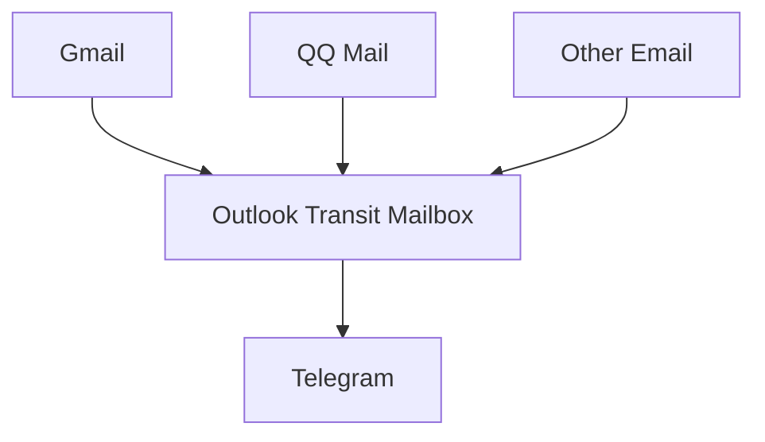

# Mail2Telegram

[中文](./README_zh.md) | English

Mail2Telegram is a Python-based project that monitors email accounts for new messages and forwards them to specified Telegram chats.

## Quick Start (using docker-compose)

1. Clone the repository and navigate to the project directory:

```bash
git clone https://github.com/Heavrnl/mail2telegram
cd ./mail2telegram
```

2. Configure `config.py`:
   - Copy `config-template.py` and rename it to `config.py`
   - Fill in the necessary configuration information (only supports Outlook email accounts without two-factor authentication)

3. Configure `docker-compose.yml`:
   - Open the `docker-compose.yml` file and add the following environment variables:

```yaml
services:
  mail2telegram:
    # ... other configurations ...
    environment:
      - LANGUAGE=English  # or Chinese
      - TIMEZONE=Asia/Shanghai  # set your preferred timezone
```

4. Start the service:

```bash
docker-compose up
```

5. The service is running successfully when you receive a "Successfully logged in" message from the Telegram bot.

## Best Practices

1. Create or use an infrequently used Outlook email account as a transit mailbox.
2. Enter the information for this Outlook email in `config.py`.
3. For all email accounts you want to forward to Telegram:
   - Enable email forwarding in their respective email settings
   - Forward emails to the Outlook email created in step 1

## Workflow



## Important Notes

- Only supports Outlook email as the transit mailbox
- Does not support email accounts with two-factor authentication enabled
- Ensure your Outlook email security settings allow access by third-party applications
- Set the correct language and timezone in `docker-compose.yml` for optimal usage
