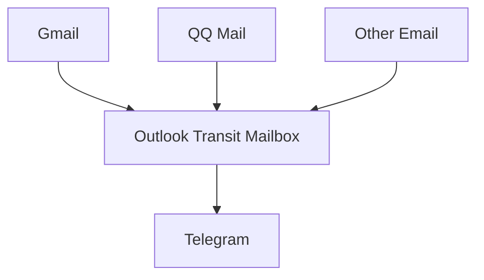
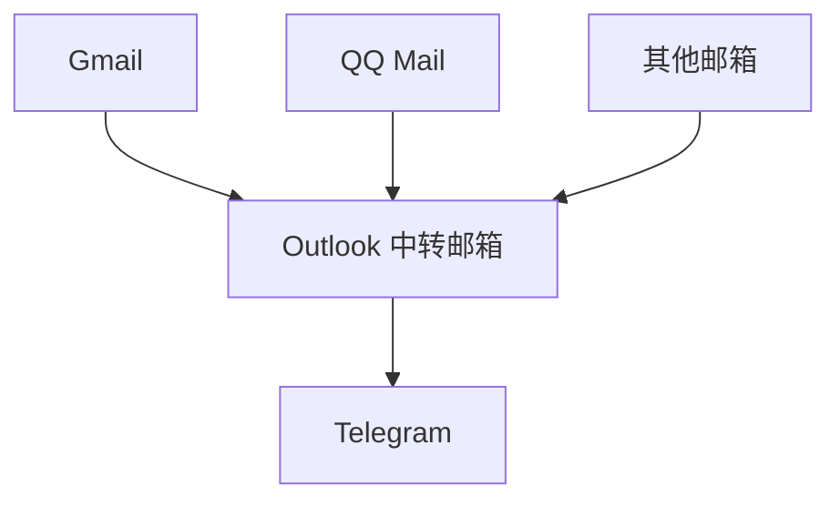

# Mail2Telegram

[中文](./README_zh.md) | English

Mail2Telegram is a Python-based project that monitors email accounts for new messages and forwards them to specified Telegram chats.

## Quick Start (using docker-compose)

1. Clone the repository and navigate to the project directory:

```bash
git clone https://github.com/Heavrnl/mail2telegram
cd ./mail2telegram
```

2. Configure `config.py`:
   - Copy `config-template.py` and rename it to `config.py`
   - Fill in the necessary configuration information (only supports Outlook email accounts without two-factor authentication)

3. Start the service:

```bash
docker-compose up
```

4. The service is running successfully when you see a login success message.

## Best Practices

1. Create or use an infrequently used Outlook email account as a transit mailbox.
2. Enter the information for this Outlook email in `config.py`.
3. For all email accounts you want to forward to Telegram:
   - Enable email forwarding in their respective email settings
   - Forward emails to the Outlook email created in step 1

## Workflow



## Important Notes

- Only supports Outlook email as the transit mailbox
- Does not support email accounts with two-factor authentication enabled
- Ensure your Outlook email security settings allow access by third-party applications

---

# Mail2Telegram

中文 | [English](./README.md)

Mail2Telegram 是一个基于 Python 的项目，用于监控电子邮件的新消息，并将其转发到指定的 Telegram 聊天中。

## 快速启动 (基于 docker-compose)

1. 克隆仓库并进入项目目录：

```bash
git clone https://github.com/Heavrnl/mail2telegram
cd ./mail2telegram
```

2. 配置 `config.py`：
   - 复制 `config-template.py` 并重命名为 `config.py`
   - 填写必要的配置信息（仅支持 Outlook 邮箱，且不支持开启两步验证的邮箱）

3. 启动服务：

```bash
docker-compose up
```

4. 当看到登录成功的提示时，服务即成功运行。

## 最佳实践

1. 创建或使用一个不常用的 Outlook 邮箱作为中转邮箱。
2. 在 `config.py` 中填入该 Outlook 邮箱的信息。
3. 对于需要转发到 Telegram 的所有邮箱：
   - 在各自的邮箱设置中开启邮件转发功能
   - 将邮件转发到步骤 1 中创建的 Outlook 邮箱

## 工作流程



## 注意事项

- 仅支持 Outlook 邮箱作为中转邮箱
- 不支持开启两步验证的邮箱
- 确保您的 Outlook 邮箱安全设置允许第三方应用访问
