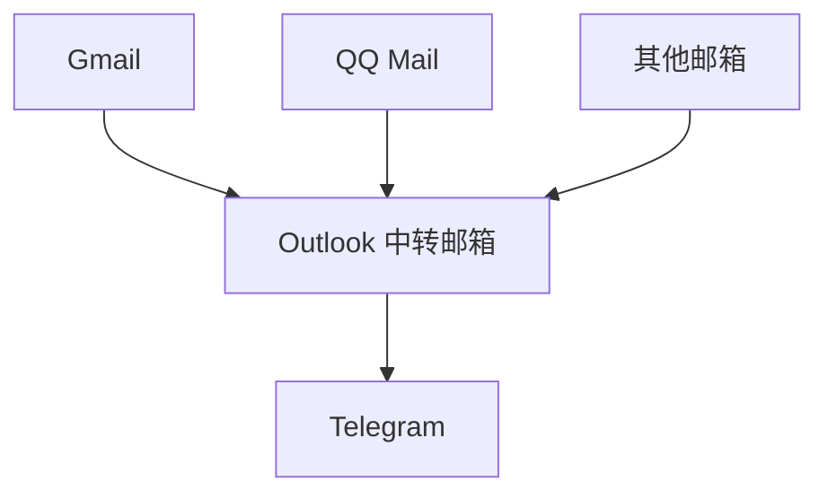

# Mail2Telegram

中文 | [English](./README.md)

Mail2Telegram 是一个基于 Python 的项目，用于监控电子邮件的新消息，并将其转发到指定的 Telegram 聊天中。

## 快速启动 (基于 docker-compose)

1. 克隆仓库并进入项目目录：

```bash
git clone https://github.com/Heavrnl/mail2telegram
cd ./mail2telegram
```

2. 配置 `config.py`：
   - 复制 `config-template.py` 并重命名为 `config.py`
   - 填写必要的配置信息（仅支持 Outlook 邮箱，且不支持开启两步验证的邮箱）

3. 配置 `docker-compose.yml`：
   - 打开 `docker-compose.yml` 文件并添加以下环境变量：

```yaml
services:
  mail2telegram:
    # ... 其他配置 ...
    environment:
      - LANGUAGE=Chinese  # 或 English
      - TIMEZONE=Asia/Shanghai  # 设置您的首选时区
```

4. 启动服务：

```bash
docker-compose up -d
```

5. 当您收到 Telegram 机器人发送的"登录成功"消息时，表示服务已成功运行。

## 最佳实践

1. 创建或使用一个不常用的 Outlook 邮箱作为中转邮箱。
2. 在 `config.py` 中填入该 Outlook 邮箱的信息。
3. 对于需要转发到 Telegram 的所有邮箱：
   - 在各自的邮箱设置中开启邮件转发功能
   - 将邮件转发到步骤 1 中创建的 Outlook 邮箱

## 工作流程



## 注意事项

- 仅支持 Outlook 邮箱作为中转邮箱
- 不支持开启两步验证的邮箱
- 确保您的 Outlook 邮箱安全设置允许第三方应用访问
- 在 `docker-compose.yml` 中设置正确的语言和时区以获得最佳使用体验
